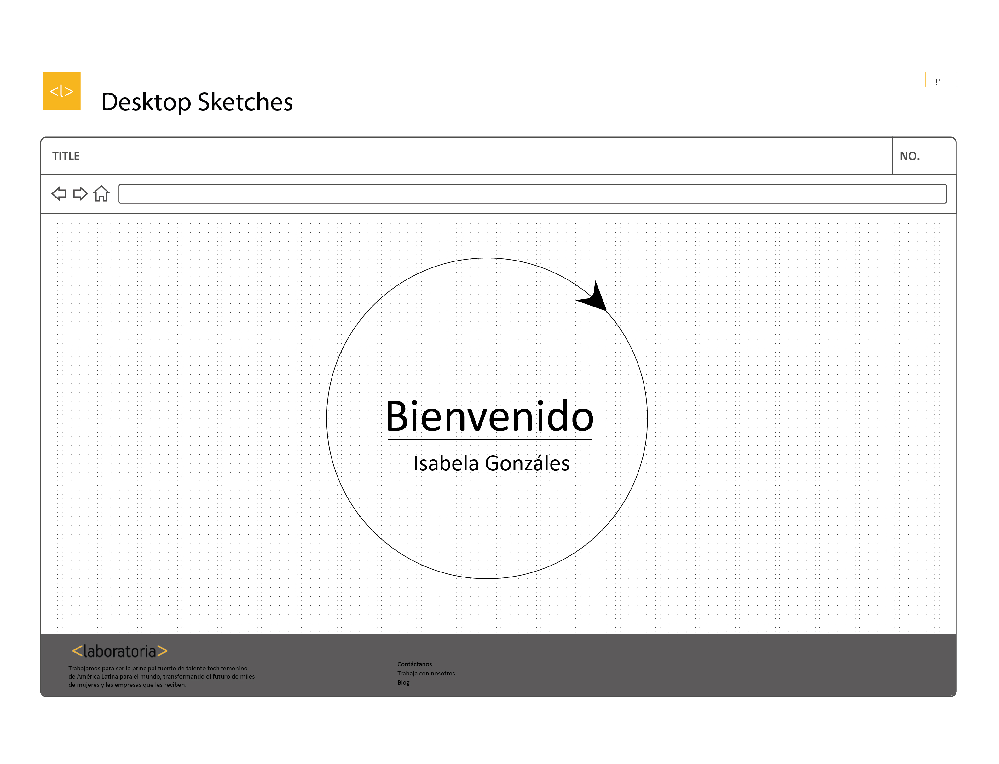
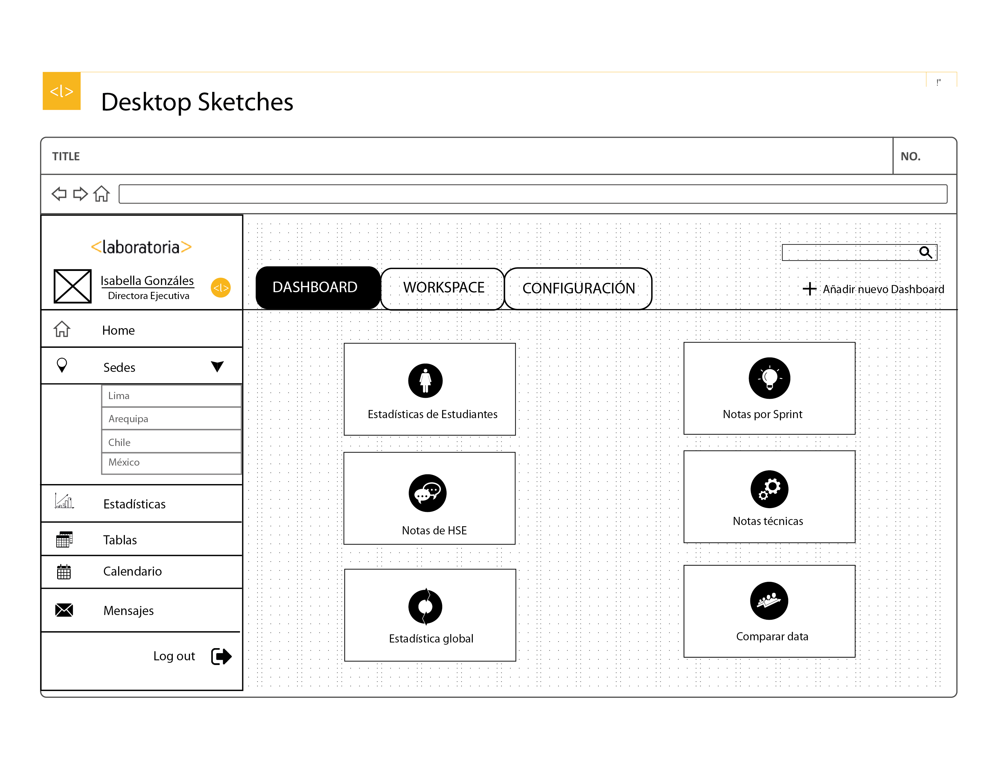
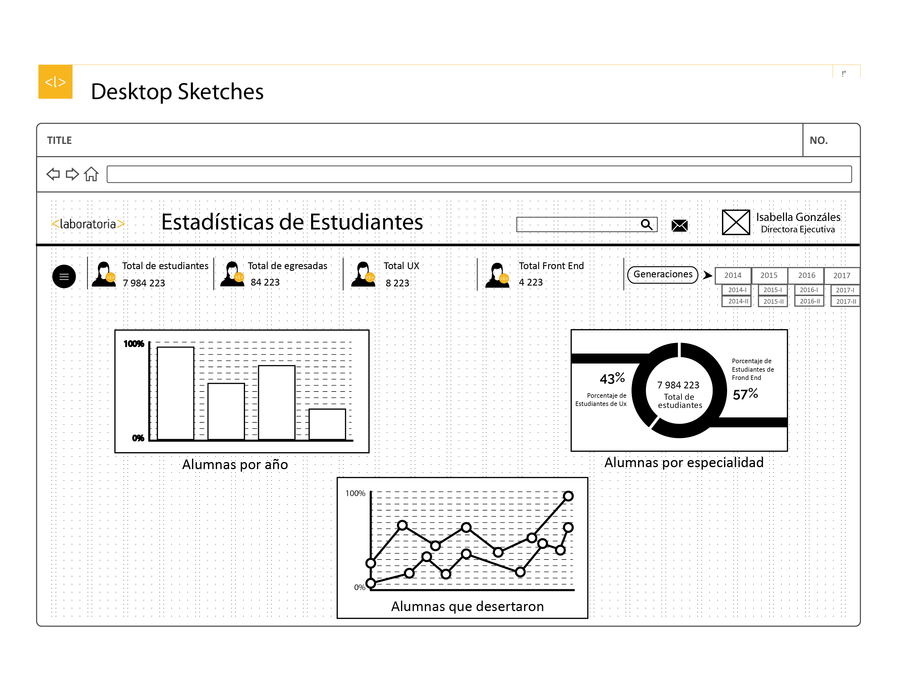
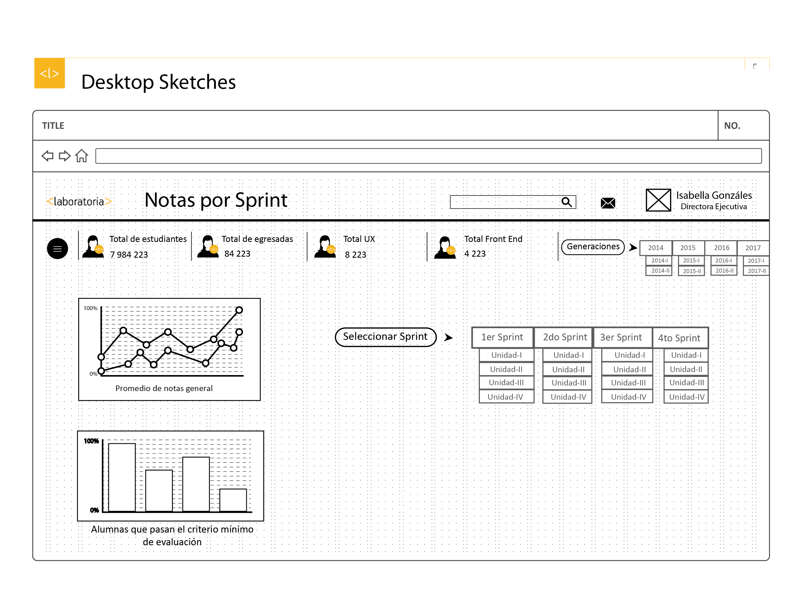
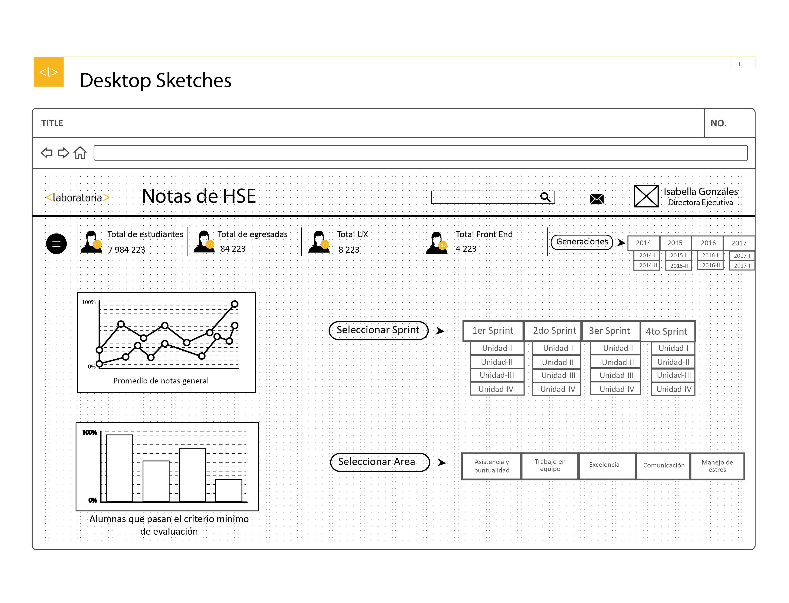
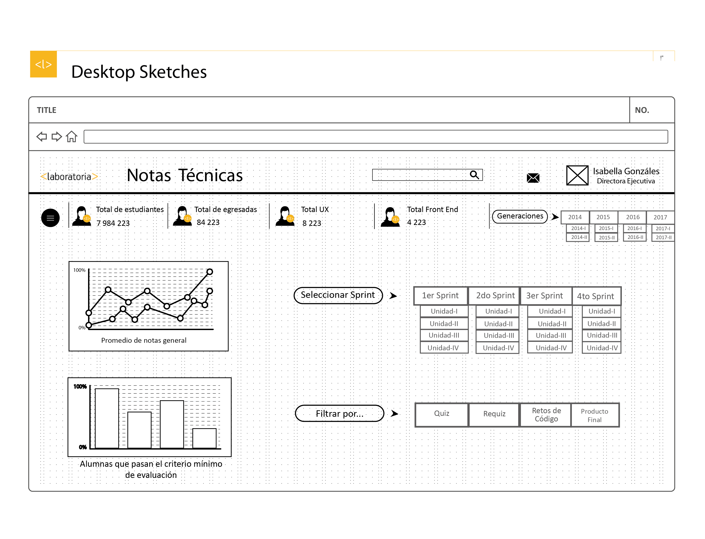
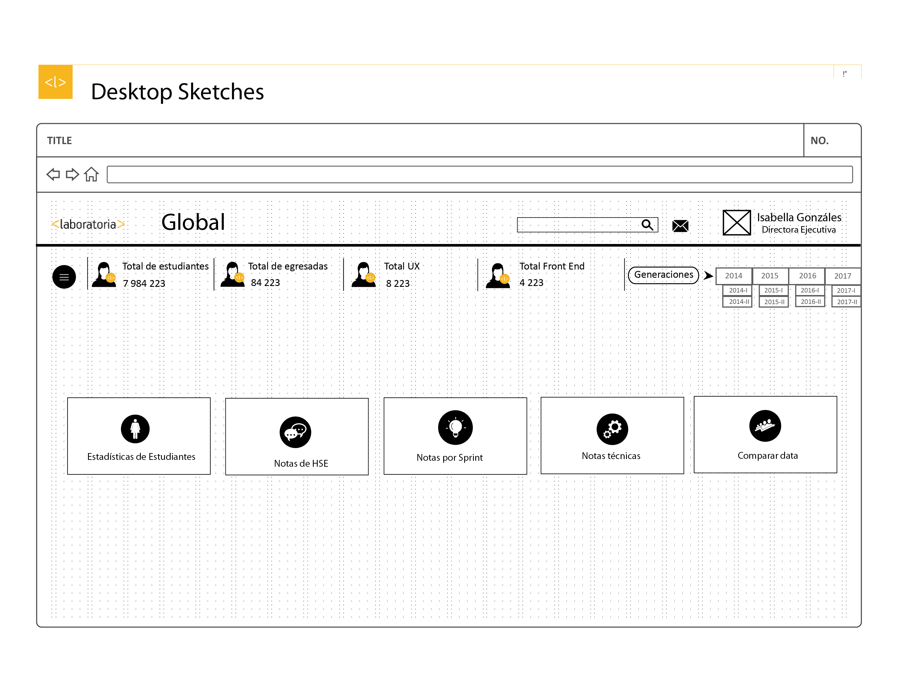
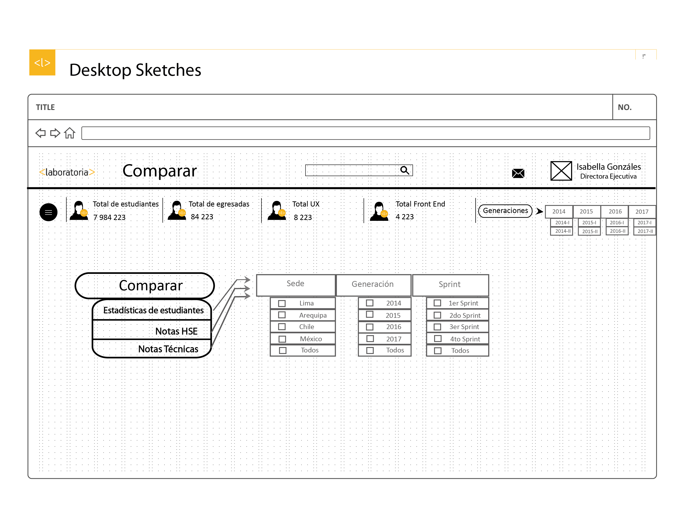

# Reto de código N° 3

## Descripción del Proyecto:

El proyecto consiste en la elaboración del sketch del dashboard de Laboratoria. Una herramienta utilizada por profesores, training managers, directores y gerentes de Laboratoria para ver rápidamente qué está pasando en el salón de clases.

## Primera ventana:

#### Descripción:

Ventana de inicio de sesión y/o registro.

En esta primera vetana se le pide al usuario ingresar su nombre de usuario y contraseña para acceder. También tiene la opción de que se guarde su contraseña, para no tener que ingresarla todas las veces. Hay una opción debajo del botón de ingresar, en caso de que el usuario haya olvidado su contraseña y también hay un enlace para registrarse. 
En la parte inferior hay un footer con navegación global, que Laboratoria mantiene en su página principal.

## Segunda ventana:

#### Descripción:

Ventada de saludo al usuario.

Una vez que el usuario ha ingresado a su cuenta, se abre otra ventana donde un círculo para apareciendo a la velocidad que carga la página. Cuando se llega a cien se completa el círculo y aparece el texto "Bienvenido2, más el nombre del usuario.

## Tercera ventana:

#### Descripción:

Muestra las opciones generales y el perfil del usuario.

La tercera ventana muestran en la parte superior se indica al usuario que está en "Dashboard", la opción "Workspace" es para que el usuario pueda insertar su propia gráfica y la opción "configuración", para modificar su perfil.

El perfil del usuario a un lado, con sus respectivas opciones:

1. Home: Le lleva al inicio de la página.

2. Sedes: se despliegan las opciones de cada sede de Laboratoria.

3. Estadísticas: Acceso directo a estadísticas

4. Tablas: Acceso directo a las tablas de cada página.

5. Calendario: Un calendario personalizado

6. Mensajes: Mensajes que se puede mandar entre usuarios.

7. Log put: Salir de su cuenta.

En la parte principal están las opciones generales.

Cuando el usuario selecciona una sede en específico, el fondo de las opciones generales cambia de color y de inmediato los datos devueltos serán de esa sede en específico. 

## Cuarta ventana:

### Estadísticas de estudiantes

#### Descripción:

Muestra las estadísticas generales de las estudiantes.

#### Header:

1. El logo de Laboratoria que lleva al usuario a la página principal de Laboratoria.

2. El título de la sección en que se encuentra el usuario.

3. Un elemento search para búsqueda directa.

4. Un ícono navegable que muestra al usuario si tiene mensajes.

5. La imagen y nombre del usuario.

#### Navegación local 

Se mantiene en cada ventana que se abre cuando el usuario da "click" en alguna opción general:

1. Menú hamburguesa que al activarse muestra el perfil del usuario.

2. Cifra de número total de estuadiantes actuales.

3. Cifra de número total actual de estuadiantes egresadas.

4. Cifra de número total de estuadiantes de UX actual.

5. Cifra de número total de estuadiantes de Font End actual.

6. Un botón "generaciones" el cual despliega opciones de selección de la generación de la cual se quiere ver la data. 

#### Opciones:

La data de varía si el usuario cambia a alguna generación. 

1. Alumas por año.

2. Alumnas por especialidad.

3. Alumnas que desertaron. 

## Quinta ventana:

### Notas por sprint

#### Descripción:

Muestra las estadísticas de las notas por Sprint y cada unidad, de las estudiantes.

#### Header:

1. El logo de Laboratoria que lleva al usuario a la página principal de Laboratoria.

2. El título de la sección en que se encuentra el usuario.

3. Un elemento search para búsqueda directa.

4. Un ícono navegable que muestra al usuario si tiene mensajes.

5. La imagen y nombre del usuario.

#### Navegación local 

Se mantiene en cada ventana que se abre cuando el usuario da "click" en alguna opción general:

1. Menú hamburguesa que al activarse muestra el perfil del usuario.

2. Cifra de número total de estuadiantes actuales.

3. Cifra de número total actual de estuadiantes egresadas.

4. Cifra de número total de estuadiantes de UX actual.

5. Cifra de número total de estuadiantes de Font End actual.

6. Un botón "generaciones" el cual despliega opciones de selección de la generación de la cual se quiere ver la data. 

#### Opciones:

La data de varía si el usuario cambia a alguna generación. 

1. Promedio de notas general.

2. Alumnas que pasan el criterio mínimo de evaluación.

3. Botón desplegable que permite filtrar por sprint y la vez, cada sprint por unidad.

## Sexta ventana:

#### Descripción:

Muestra las estadísticas de las notas de Habilidades Socio Emocionales de las estudiantes.

### Notas de HSE

#### Header:

1. El logo de Laboratoria que lleva al usuario a la página principal de Laboratoria.

2. El título de la sección en que se encuentra el usuario.

3. Un elemento search para búsqueda directa.

4. Un ícono navegable que muestra al usuario si tiene mensajes.

5. La imagen y nombre del usuario.

#### Navegación local 

Se mantiene en cada ventana que se abre cuando el usuario da "click" en alguna opción general:

1. Menú hamburguesa que al activarse muestra el perfil del usuario.

2. Cifra de número total de estuadiantes actuales.

3. Cifra de número total actual de estuadiantes egresadas.

4. Cifra de número total de estuadiantes de UX actual.

5. Cifra de número total de estuadiantes de Font End actual.

6. Un botón "generaciones" el cual despliega opciones de selección de la generación de la cual se quiere ver la data. 

#### Opciones:

La data de varía si el usuario cambia a alguna generación. 

1. Promedio de notas general.

2. Alumnas que pasan el criterio mínimo de evaluación.

3. Botón desplegable que permite filtrar por sprint y la vez, cada sprint por unidad.

4. Botón desplegable que permite filtrar por cada área que se califica en el HSE.

## Séptima ventana:

#### Descripción:

Muestra las estadísticas de las notas tecnicas de las estudiantes.

### Notas Técnicas

#### Header:

1. El logo de Laboratoria que lleva al usuario a la página principal de Laboratoria.

2. El título de la sección en que se encuentra el usuario.

3. Un elemento search para búsqueda directa.

4. Un ícono navegable que muestra al usuario si tiene mensajes.

5. La imagen y nombre del usuario.

#### Navegación local 

Se mantiene en cada ventana que se abre cuando el usuario da "click" en alguna opción general:

1. Menú hamburguesa que al activarse muestra el perfil del usuario.

2. Cifra de número total de estuadiantes actuales.

3. Cifra de número total actual de estuadiantes egresadas.

4. Cifra de número total de estuadiantes de UX actual.

5. Cifra de número total de estuadiantes de Font End actual.

6. Un botón "generaciones" el cual despliega opciones de selección de la generación de la cual se quiere ver la data. 

#### Opciones:

La data de varía si el usuario cambia a alguna generación. 

1. Promedio de notas general.

2. Alumnas que pasan el criterio mínimo de evaluación.

3. Botón desplegable que permite filtrar por sprint y la vez, cada sprint por unidad.

4. Botón desplegable que permite filtrar por cada tipo de evaluación técnica. 

## Octava ventana:

#### Descripción: 

Muestra las estadísticas a nivel general, es decir, las cuatro sedes juntas.

### Global

#### Header:

1. El logo de Laboratoria que lleva al usuario a la página principal de Laboratoria.

2. El título de la sección en que se encuentra el usuario.

3. Un elemento search para búsqueda directa.

4. Un ícono navegable que muestra al usuario si tiene mensajes.

5. La imagen y nombre del usuario.

#### Navegación local 

Se mantiene en cada ventana que se abre cuando el usuario da "click" en alguna opción general:

1. Menú hamburguesa que al activarse muestra el perfil del usuario.

2. Cifra de número total de estuadiantes actuales.

3. Cifra de número total actual de estuadiantes egresadas.

4. Cifra de número total de estuadiantes de UX actual.

5. Cifra de número total de estuadiantes de Font End actual.

6. Un botón "generaciones" el cual despliega opciones de selección de la generación de la cual se quiere ver la data. 

#### Opciones:

La data de varía si el usuario cambia a alguna generación. 

En este caso de acuerdo a la opción que el usuario elija, volvería a mostrar las ventanas correspondientes a cada opción.

1. Estadísticas de estudiantes (de todas las sedes)

2. Notas HSE (de todas las sedes)

3. Notas por Sprint (de todas las sedes)

4. Notas técnicas (de todas las sedes).

5. Comparar las estadísticas. 

## Novena ventana:

### Comparar

#### Descripción:

Muestra la comparación de las estadísticas entre sedes, generaciones de estudiantes y sprints. 

#### Header:

1. El logo de Laboratoria que lleva al usuario a la página principal de Laboratoria.

2. El título de la sección en que se encuentra el usuario.

3. Un elemento search para búsqueda directa.

4. Un ícono navegable que muestra al usuario si tiene mensajes.

5. La imagen y nombre del usuario.

#### Navegación local 

Se mantiene en cada ventana que se abre cuando el usuario da "click" en alguna opción general:

1. Menú hamburguesa que al activarse muestra el perfil del usuario.

2. Cifra de número total de estuadiantes actuales.

3. Cifra de número total actual de estuadiantes egresadas.

4. Cifra de número total de estuadiantes de UX actual.

5. Cifra de número total de estuadiantes de Font End actual.

6. Un botón "generaciones" el cual despliega opciones de selección de la generación de la cual se quiere ver la data. 

#### Opciones:

La data de varía si el usuario cambia a alguna generación. 

1. Se dan tres opciones para comparar: notas generales, nostas HSE y notas técnicas.

2. Al dar "click" en cualquiera de esas tres opciones, se abren tres botones desplegables: Sede, Generación y Sprint. Cada uno de ellos con sus respectivas opciones para que el usuario elija que quiere comparar.  

3. Una vez que el usuario ha seleccionado por ejemplo: Notas Hse - Sede - Lima y Arequipa, se mostrará la estadística comparativa de acuerdo a lo pedido. 
